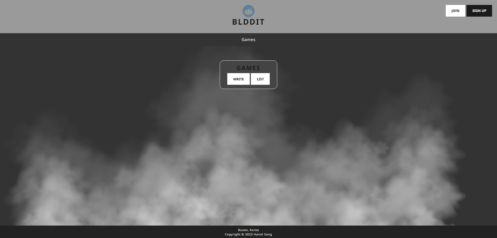
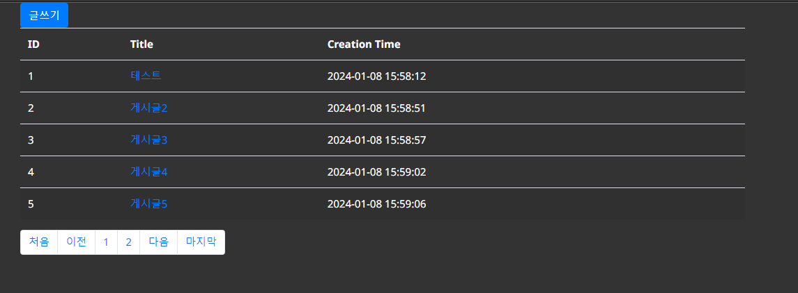
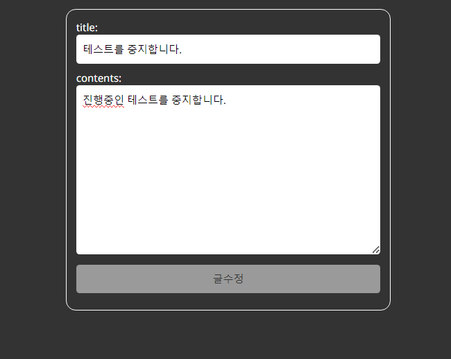
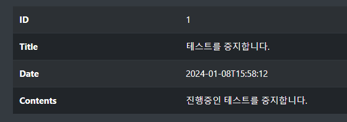

# Simple Fork's Board v0.y.z

## ⚙️ 개발환경

**IDE : IntelliJ IDEA Community** : v2023.2    
**Java Development Kit** : v11    
**JAVA** : v17    
**Spring Boot** : v2.7.6    
**MySQL** : v8.0.35    
**Gradle** : Groovy    
**Lombok** : v1.18.24    
**Thymeleaf** : v3.0.15    
## 📌 주요 기능
### 메인페이지
> 메인 페이지 입니다. 
> 글 작성 또는 목록으로 이동하여 현재 작성된 게시글 열람을 할 수 있습니다.
   

### 📋 게시글
#### 1. 게시글 작성
> 텍스트, 파일들 첨부 및 업로드가 가능합니다.

##### `/board/create`

정보를 입력받는 View 입니다.
    

##### `/board/save`
입력받은 정보를 가져와 저장합니다.
    
    
    
    
   
#### 2. 게시글 목록
> 현재 업로드된 게시글들을 확인할 수 있습니다.

##### `/board/` or `/board/paging`

게시판 목록 View 입니다.
 

게시판 목록은 한 페이지에 5개씩 제한되며 페이지 번호는 `3` 까지 제공되며 
`3`이후의 게시글의 열람은 `다음` 버튼으로 상호작용하여 `4`페이지의 확인이 가능합니다.
    
    
    
    

#### 3. 게시글 조회
> 업로드된 게시글의 본문, 댓글, 첨부파일 또한 확인이 가능합니다.
> 첨부파일은 **다운로드**가 가능합니다.

##### `/board/{id}`

해당 게시글의 본문 입니다.

##### `/download/{uuid}/{filename}`

업로드된 파일의 `uuid`와 `filename`의 경로로 파일을 다운로드 합니다.
 

게시글 본문의 **Download** 버튼을 상호작용하여 첨부파일을 다운로드 하세요.
    
    
    
    
   
#### 4. 게시글 수정
> 업로드된 게시글의 본문의 수정이 가능합니다.
> 특정 게시글을 조회 후 **수정 버튼**으로 상호작용 합니다.

##### `/board/update/{id}`

게시글 본문의 텍스트 수정이 가능한 View 입니다.

##### `/board/update`

수정사항을 입력한 정보를 가져와 저장합니다.
    
    
    
    

#### 5. 게시글 삭제
> 업로드된 게시글의 삭제가 가능합니다.
> 특정 게시글을 조회 후 **삭제 버튼**으로 상호작용 합니다.

 

##### `/board/delete/{id}`

특정 게시글로 이동하면 해당 게시글의 `id`를 참조하여 삭제합니다.

---
### ✏️ 댓글
#### 1. 댓글 작성
> 특정 게시글 조회 (`/board/{id}`) 후 하단에 댓글 작성이 가능합니다.

 

##### `/comment/save`
댓글의 입력 정보를 받아 저장하고 그 즉시 View로 반환되어 작성된 댓글 확인이 가능합니다.

## 📃 업데이트 프리뷰
___해당 내용은 예정이며 순서 상관이 없으며 예고없이 추가, 수정, 삭제될 수 있습니다.___
    
    
### 🤴 회원제
> 지금의 **게시판**은 누구나 자유롭게 어떤 게시글이든 수정과 삭제가 가능합니다.
> 
> 취약한 보안을 보완하며 사용자가 편하게 사용하고 관리할 수 있도록 편의 기능을 제공하고자 합니다.

- 회원가입
- MyPage 생성
- 본인의 게시글, 댓글 등의 수정 혹은 삭제에 대한 고유 권한 부여
- 작성했던 게시글과 댓글 모아보기
    
    
### 📋 게시글
> 작성된 날짜와 시간을 한눈에 보기 어렵다고 판단하고 있습니다.
> 
> 사용자가 한눈에 들어오도록 날짜와 시간을 수정하고자 합니다.

- 작성된 시간을 표시, 해당 날짜가 넘어간다면 작성했던 날짜만 표시
	어제 작성되었다면 _12/03_
	오늘 작성되었다면 _16:24_
	작년에 작성되었다면 _22/12/04_
    
    
### ✏️ 댓글
> 현재 댓글의 수정과 삭제 기능이 부재중 입니다.
> 
> 따라서 기본적인 수정과 삭제 기능과 작성했던 날짜를 표시해 사용자의 편의성을 개선합니다.

- 수정
- 삭제
- 작성된 시간을 표시, 해당 날짜가 넘어간다면 작성했던 날짜만 표시
    
    
### 💾 게시글 목록
> 1페이지만 열람이 가능하며 버튼 2번, 버튼 3번, 처음, 이전, 다음, 마지막 버튼의 경로가 설정되어 있지 않아 `404` 에러가 발생하고 있습니다.
> 
> 원활한 게시글 열람을 위해 수정 하고자 합니다.

- 게시글 목록의 상호 작용한 링크들의 올바른 경로 설정
    
    
    
## 📚 버전 히스토리
##### v0.5.2 ( 23/11/30 )
###### [ 🛠️ Fix ]
1. 작성된 댓글이 안보이는 버그가 수정됩니다.
    
2. 목록으로 갔다 돌아오면 댓글이 안보이는 버그가 수정됩니다.
    
3. 이제는 신규 게시글 등록시 첨부파일이 없어도 등록이 가능해집니다. 
    
    
##### v0.5.1 ( 23/11/28 )
1. 게시글에 첨부한 **파일의 다운로드**가 가능합니다.
    
##### [ 🛠️ Fix ]
1. 첨부파일이 포함된 게시글 삭제시 첨부파일 또한 같이 삭제되게 변경됩니다.
   - 게시글이 삭제되도 서버 내의 지정된 경로에 파일이 삭제되지 않아 더미파일로 남게되는 현상이 수정됩니다.
    
    
##### v0.4.0 ( 23/11/27 )
1. **파일 첨부** 기능이 추가되었습니다.
   - 사용자는 게시글을 신규작성 혹은 수정시 단일 혹은 다수의 파일 첨부가 가능합니다.
   - 첨부된 파일은 서버의 지정된 경로에 저장됩니다.
    
    
##### v0.3.0 ( 23/11/24 )
1. **댓글 작성** 기능이 추가되었습니다.
   - 특정 게시글로 이동해 작성자와 내용칸을 기입해 댓글 작성 버튼과 상호작용하여 댓글 등록이 가능합니다.
    
    
##### v0.2.0 ( 23/11/23 )
1. **게시글 목록**이 생성되었습니다.
   - 해당 페이지에서 현재까지 작성된 게시글 열람이 가능합니다. 
2. **게시글 작성 페이지**로 이동이 가능합니다.
   - 해당 페이지에서 사용자는 편하게 게시글 작성이 가능합니다.
    
3. 특정 **게시글의 상세 조회**가 가능합니다.
   - **작성일자와 시간, 제목, 본문, 글번호**를 확인할 수 있습니다.
    
4. **게시글의 수정**이 가능합니다.
   - 제목과 본문의 수정 버튼과 상호작용해 수정이 가능합니다.
    
5. **게시판의 삭제**가 가능합니다.
   - 특정 게시글의 페이지로 이동해 삭제 버튼으로 상호작용이 가능합니다.
    
    
##### v0.1.0 ( 23/11/21 )
1. **게시글 신규 작성** (제목, 내용)이 가능합니다.
    
2. **메인페이지** `("/")` 이동 경로가 생성 되어 글쓰기, 목록 버튼이 생성되었습니다.
